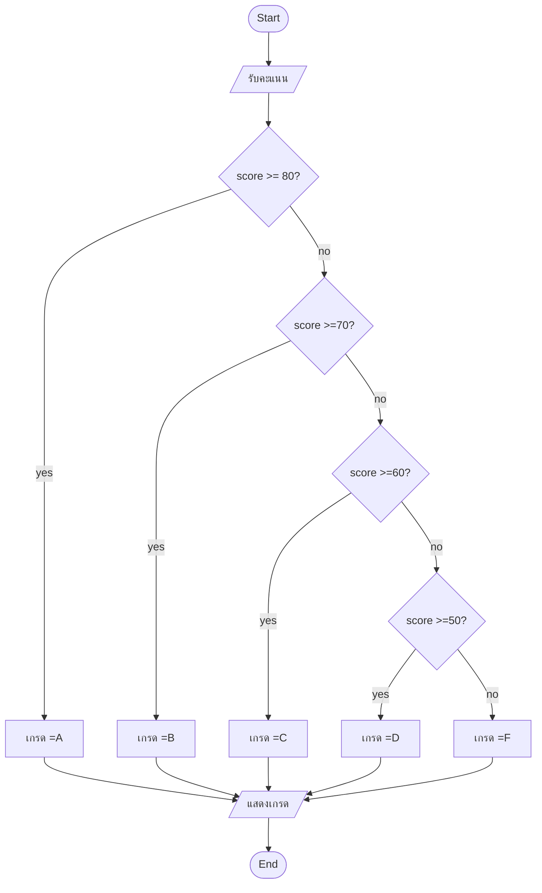
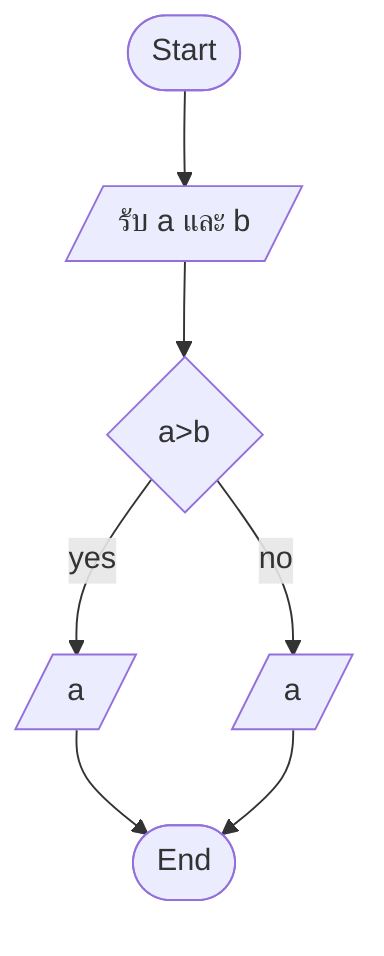
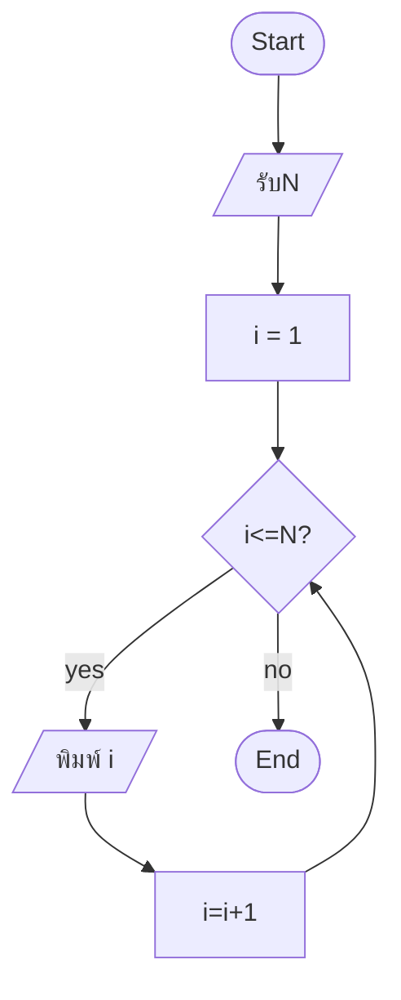

```mermaid
flowchart TD
 Start([Start]) -->input[/รับคะแนน/]
 input -->d1{score >= 80?}
 d1 -->|yes| A[เกรด =A]
 d1 -->|no| d2{score >=70?}
 d2 -->|yes| B[เกรด =B]
 d2 -->|no| d3{score >=60?}
 d3 -->|yes| C[เกรด =C]
 d3 -->|no| d4{score >=50?}
 d4 -->|yes| D[เกรด =D]
 d4 -->|no| F[เกรด =F]
 A & B & C & D & F --> Output[/แสดงเกรด/]
 -->End([End])

```

```mermaid
flowchart TD
 A([Start]) -->Input[/รับ a และ b/]
 Input -->123{ a>b}
  123 --> |yes| x[/a/]
  123 --> |no| z[/a/]
  x & z
  -->B([End])

```

```mermaid
flowchart TD
 Start([Start])--> A[/รับN/]
A -->B[i = 1]
B -->C{i<=N?}
C--> |yes|D[/พิมพ์ i/]--> F[i=i+1]
C--> |no|End([End])
F-->C

```
