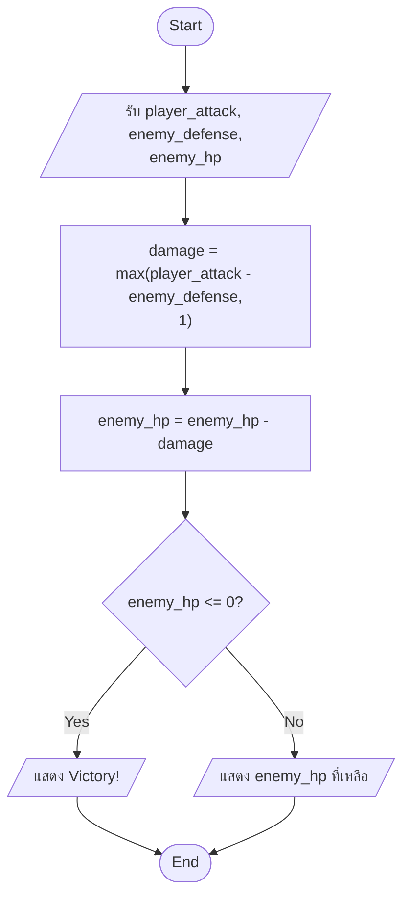
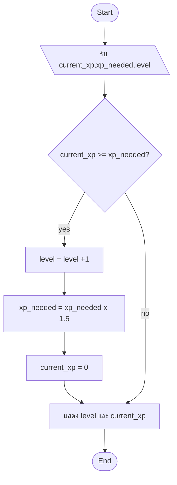

```mermaid
flowchart TD
 Start([Start]) --> Input[/รับ player_attack, enemy_defense,
enemy_hp/]
 Input --> Calc["damage = max(player_attack - enemy_defense,
1)"]
 Calc --> Reduce["enemy_hp = enemy_hp - damage"]
 Reduce --> D1{enemy_hp <= 0?}
 D1 -->|Yes| Win[/แสดง Victory!/]
 D1 -->|No| Show[/แสดง enemy_hp ที่เหลือ/]
 Win & Show --> End([End])
```

```mermaid
flowchart TD
 Start([Start]) --> A[\รับ current_xp,xp_needed,level\]
 A-->B{current_xp >= xp_needed?}
B-->|yes| c[level = level +1]
c--> d[xp_needed = xp_needed x 1.5]
d--> f[current_xp = 0]
f--> g[แสดง level และ current_xp]
B-->|no| g
g --> End([End])
```
